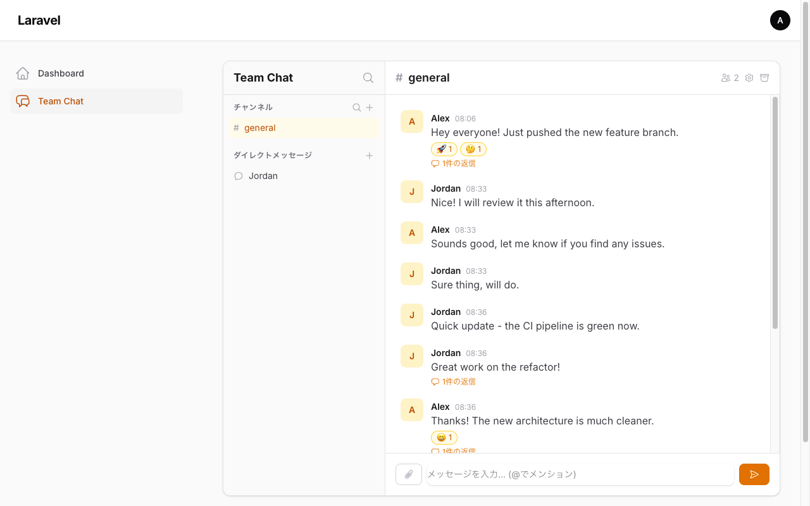
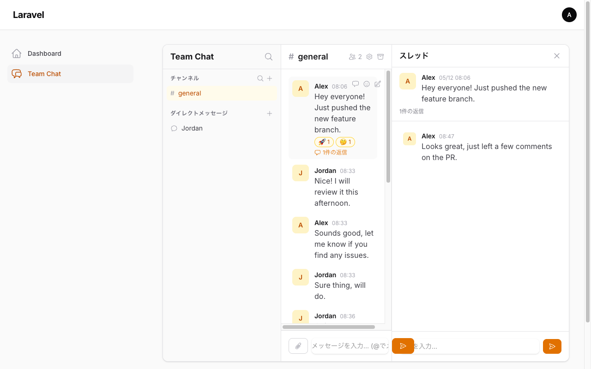
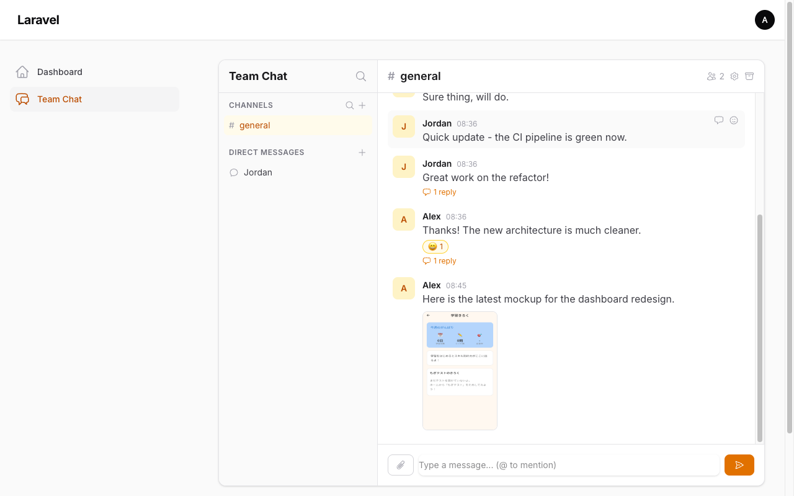
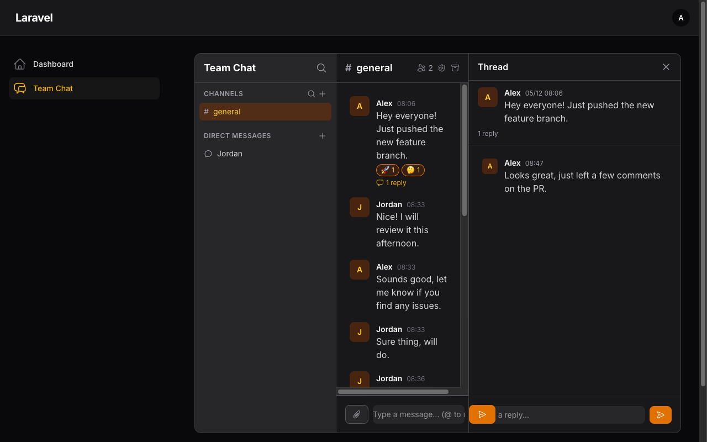

# Filament Team Chat

**A complete Slack-like team chat for Filament v5.** Drop it into any panel — channels, DMs, threads, reactions, mentions, file sharing, search, and unread tracking work out of the box. Self-hosted, no external services needed.


---



## Why Filament Team Chat?

- **Zero external dependencies** — No Pusher, no Redis, no WebSocket server. Works with Livewire polling out of the box.
- **Filament-native** — Lives inside your Filament panel. Uses your existing auth, your existing users, your existing database.
- **Multi-tenant ready** — Optional `team_id` scoping with automatic Filament tenant detection.
- **Self-hosted** — Your data stays on your server. No third-party chat services.

## Screenshots

<table>
  <tr>
    <td><strong>Threaded Conversations</strong><br/>Click any message to reply in a side panel — just like Slack.<br/><br/></td>
    <td><strong>File Attachments</strong><br/>Share images (with inline preview) and documents.<br/><br/></td>
  </tr>
  <tr>
    <td colspan="2"><strong>Dark Mode</strong><br/>Full dark mode support, following your Filament panel theme.<br/><br/></td>
  </tr>
</table>

## Features

### Messaging
- **Channels** — Public and private channels with member management
- **Direct Messages** — 1-on-1 and group DMs
- **Threads** — Reply to any message in a side panel, with reply count on the main feed
- **Markdown** — Messages support **bold**, *italic*, `code`, lists, and links
- **Edit & Delete** — Edit or soft-delete your own messages (hover action bar)

### Collaboration
- **Reactions** — 8 built-in emoji reactions (toggle on/off)
- **@Mentions** — `@user`, `@channel`, `@here` with live autocomplete
- **File Attachments** — Upload multiple files per message, image previews, download links
- **Search** — Full-text search across all channels and DMs you belong to

### Awareness
- **Unread Badges** — Per-channel/DM unread counts with automatic read tracking
- **Instant Refresh** — Your own messages appear immediately; others update via polling
- **Online Status** — Presence indicators and custom status text
- **Notifications** — Database notifications for @mentions and DMs

### Management
- **Inline Channel Settings** — Edit name, topic, and visibility directly in the chat header (owner only)
- **Archive Channels** — Soft-archive channels to hide them from the sidebar
- **Public Auto-Join** — Public channels appear for all users; clicking auto-joins
- **Member List** — View channel/DM members with online indicators and profile cards

### Technical
- **Multi-Tenancy** — Optional `team_id` scoping with Filament tenant auto-detection
- **Dark Mode** — Follows your Filament panel theme
- **102 Tests** — Comprehensive test suite with Orchestra Testbench

## Installation

```bash
composer require qalainau/filament-team-chat
```

Publish and run the migrations:

```bash
php artisan vendor:publish --tag=team-chat-migrations
php artisan migrate
```

## Getting Started

### 1. Register the Plugin

```php
use Filament\TeamChat\FilamentTeamChatPlugin;

public function panel(Panel $panel): Panel
{
    return $panel
        // ...
        ->plugin(FilamentTeamChatPlugin::make());
}
```

### 2. Add the Trait to Your User Model

```php
use Filament\TeamChat\Concerns\HasTeamChat;

class User extends Authenticatable
{
    use HasTeamChat;
}
```

### 3. Notifications Table (if needed)

Required for @mention and DM notifications:

```bash
php artisan make:notifications-table
php artisan migrate
```

### 4. Custom Filament Theme

If you use a custom Filament theme, add the package views so Tailwind picks up the classes:

```css
/* resources/css/filament/admin/theme.css */
@source '../../../../vendor/qalainau/filament-team-chat/resources/views/**/*';
```

Then run `npm run build`.

**Done!** Visit `/admin/team-chat` to start chatting.

## Configuration

Publish the config file:

```bash
php artisan vendor:publish --tag=team-chat-config
```

```php
// config/team-chat.php
return [
    'table_prefix' => 'tc_',

    'user_model' => \App\Models\User::class,

    'polling' => [
        'messages' => 3,  // seconds
        'sidebar' => 5,   // seconds
    ],

    'uploads' => [
        'disk' => 'public',
        'directory' => 'team-chat-attachments',
        'max_size' => 10240, // KB
    ],

    'tenancy' => [
        'enabled' => false,
        'model' => null,    // e.g. \App\Models\Team::class
        'resolver' => null, // null = Filament::getTenant()
    ],
];
```

### Multi-Tenancy

Set `tenancy.enabled` to `true` to scope channels and conversations per team. The resolver supports:

| Mode | Config | Behavior |
|---|---|---|
| Auto (default) | `null` | Uses `Filament::getTenant()` |
| Callable | `fn () => auth()->user()->team_id` | Custom closure |
| Class | `TenantResolver::class` | Must have `resolve()` method |

## Programmatic API

All features are available as PHP classes — useful for seeders, commands, or integrations.

### Channels & DMs

```php
use Filament\TeamChat\Models\Channel;

// Create a channel
$channel = Channel::create([
    'name' => 'general',
    'slug' => 'general',
    'type' => 'public', // or 'private'
    'created_by' => $user->id,
]);
$channel->members()->attach($user->id, ['role' => 'owner']);

// DMs (idempotent — returns existing conversation if found)
$dm = $user->findOrCreateDirectMessage($otherUser->id);

// Group DM
$group = $user->createGroupConversation(
    userIds: [$user2->id, $user3->id],
    name: 'Project Team',
);
```

### Messages

```php
use Filament\TeamChat\Actions\SendMessage;

$message = app(SendMessage::class)->execute(
    messageable: $channel,    // Channel or Conversation
    userId: $user->id,
    body: 'Hello @Jordan! Check this **bold** text.',
    parentId: null,           // set for thread replies
    files: [],                // array of UploadedFile
);
```

### Reactions, Read Tracking, Search

```php
use Filament\TeamChat\Actions\{ToggleReaction, MarkAsRead, SearchMessages};

// Toggle reaction (returns true=added, false=removed)
app(ToggleReaction::class)->execute($message->id, $user->id, '👍');

// Unread count
$channel->unreadCountFor($user->id); // => 3

// Mark as read
app(MarkAsRead::class)->execute($channel, $user->id);

// Search (respects channel/DM membership)
$results = app(SearchMessages::class)->execute($user->id, 'deploy', limit: 20);
```

## Architecture

### Database

All tables use a configurable `tc_` prefix:

| Table | Purpose |
|---|---|
| `tc_channels` | Public/private channels (optional `team_id`) |
| `tc_channel_user` | Channel membership pivot with roles |
| `tc_conversations` | 1-on-1 and group DMs (optional `team_id`) |
| `tc_conversation_user` | DM participant pivot |
| `tc_messages` | Polymorphic messages (Channel or Conversation) |
| `tc_reactions` | Emoji reactions per message per user |
| `tc_attachments` | File metadata (name, path, MIME, size) |
| `tc_mentions` | @user / @channel / @here per message |
| `tc_read_receipts` | Per-user last-read tracking (polymorphic) |
| `tc_user_statuses` | Online status, display name, custom status |

### Livewire Components

| Component | Role | Updates |
|---|---|---|
| `Sidebar` | Channel/DM list, unread badges, create/join | 5s poll + event |
| `MessageFeed` | Messages, reactions, edit/delete, reply | 3s poll + event |
| `MessageComposer` | Input, file upload, @mention autocomplete | on submit |
| `ChannelHeader` | Name, topic, members, settings, archive | on event |
| `ThreadPanel` | Threaded replies with own composer | 3s poll |
| `SearchModal` | Full-text search across channels/DMs | on input |
| `MemberList` | Member list with online status | on open |
| `UserProfileCard` | Profile popup with DM shortcut | on open |

## Testing

```bash
# Run in the package directory
composer test

# Or in your Laravel app
php artisan test --filter=TeamChat
```

102 tests covering channels, DMs, threads, reactions, mentions, attachments, search, read receipts, notifications, user status, and channel management.

## Changelog

Please see [CHANGELOG](CHANGELOG.md) for more information on what has changed recently.

## License

The MIT License (MIT). Please see [License File](LICENSE.md) for more information.
